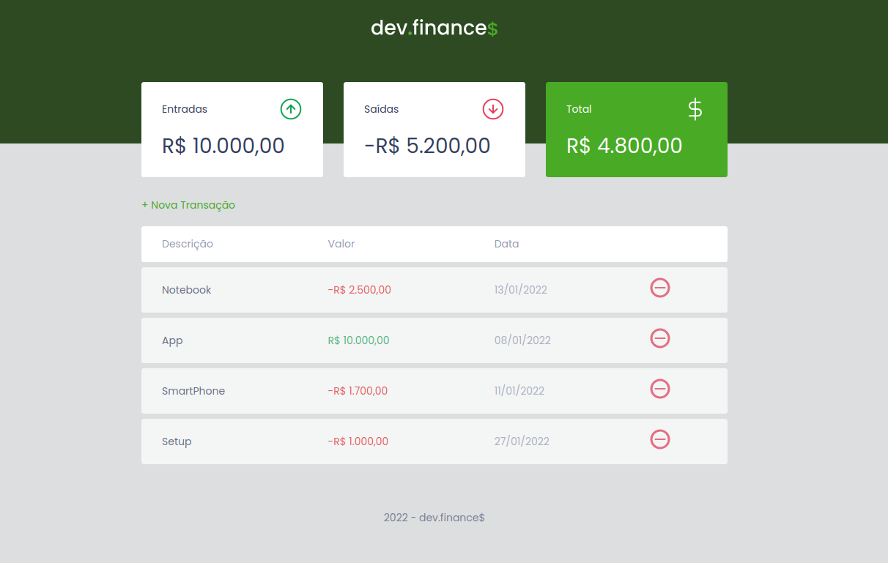
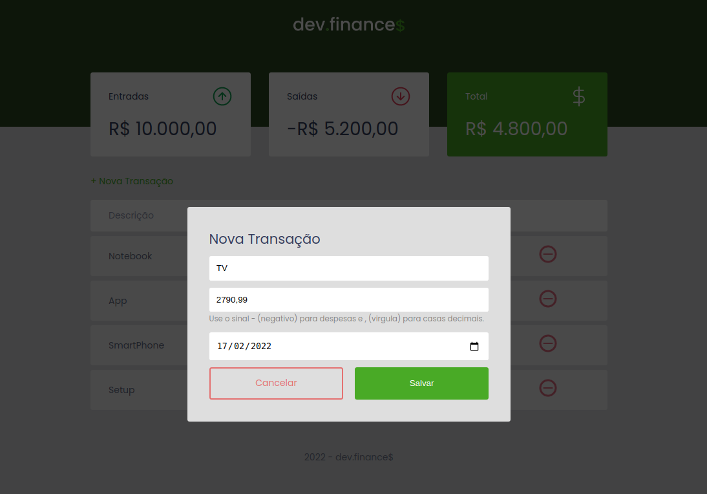
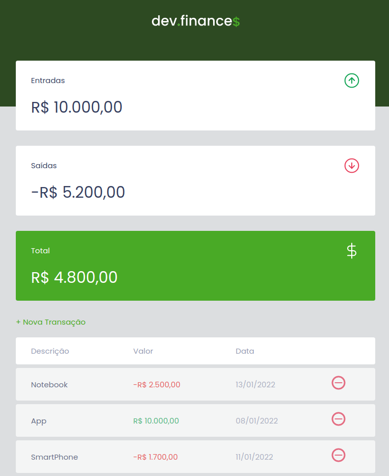

<h1 align="center">Dev Finance$</h1>

  

  

  

  

  <a href="#dart-about">About</a> &#xa0; | &#xa0;
  <a href="#rocket-technologies">Technologies</a> &#xa0; | &#xa0;
  <a href="#memo-license">License</a> &#xa0; | &#xa0;
  <a href="#eye-view">View</a>

 

## :dart: About ##

A simple app finance control using HTML, CSS and JS. This project was developed during the discover marathon by <a href="https://github.com/Rocketseat">Rocketseat</a>.

## :rocket: Technologies ##

The following tools were used in this project:

- HTML
- CSS
- JavaScript

## :memo: License ##

This project is under license from MIT. For more details, see the [LICENSE](LICENSE) file.

## :eye: View ##

#### Desktop View ####

#### Form View ####

#### Mobile View ####
